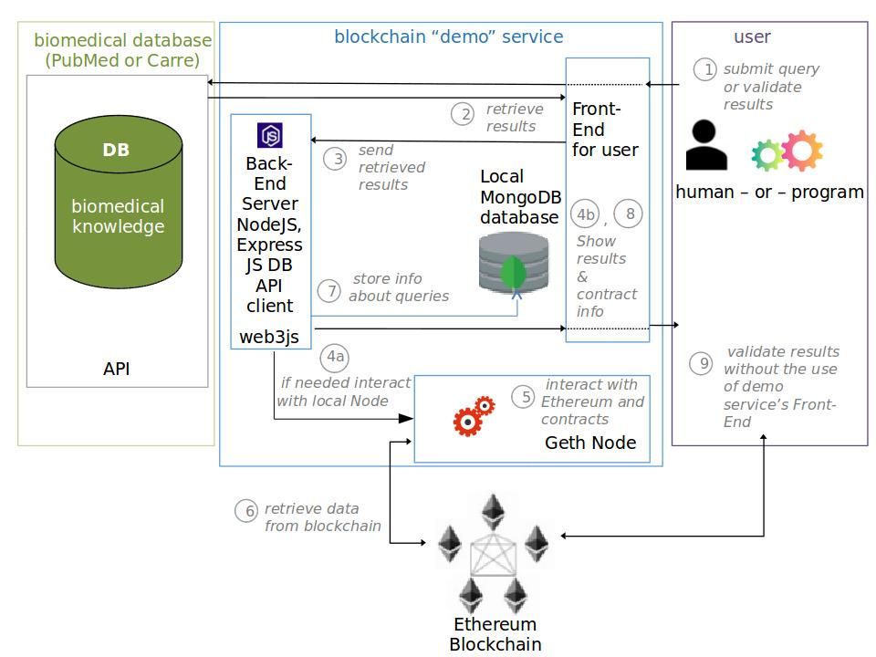
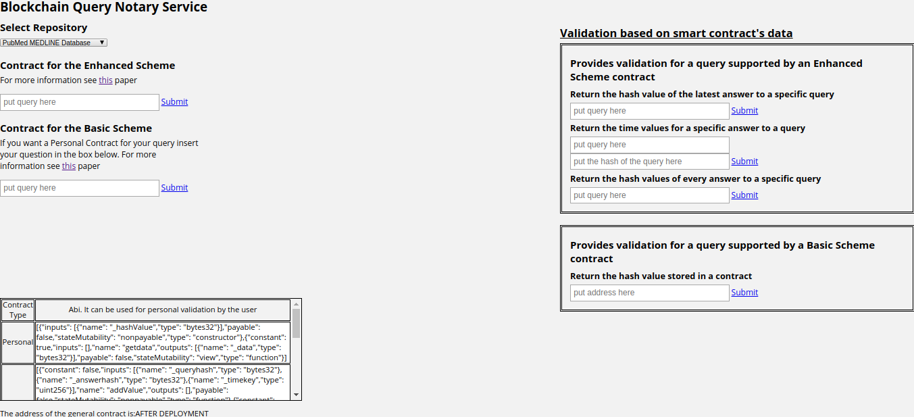
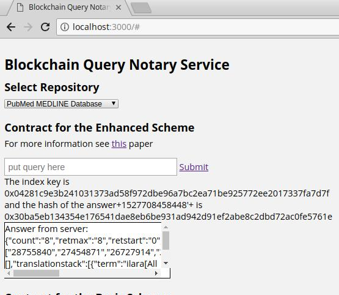
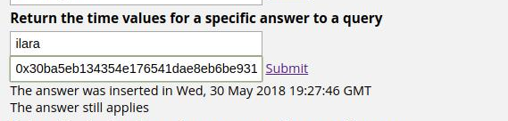

# A DApp that serves as a notarization service for data retrieved from a mediacal database

This project was developed for my diploma thesis in order to obtain the Master's Degree of Electrical and Computer Engineering from the school of Engineering of Democritus University of Thrace in 2018. The implemented DApp is a fullstack DApp that could be used as a notarization service. Also a paper descibing the decentralized application is submitted for publication.
 

The blockchain technology can be applied in healthcare in order to ensure the integrity and non-repudiation of the data provided by a biomedical repository, given that the information stored in such repositories change as the science progresses and they are highly important as they are applied in the sensitive domain of biomedical science. For those reasons the purpose of this diploma thesis is the use of blockchain technology as a notary service, so the provider of medical knowledge is bounded to the information he provides. The decentralized application that is developed is running on the Ethereum platfom and uses the tools supporting it. The application was tested with the medical reposiroties of <a href="https://www.carre-project.eu/innovation/carre-risk-factor-entry-system/" target="_blank">CARRE</a> and <a href="https://www.ncbi.nlm.nih.gov/pubmed/" target="_blank">PubMed</a> and it can be adapted to support any database.

More specifically the application that is developed provides to the users the possibility to submit a query, in one of the two biomedical databases, and subsequently to receive the information that they seek along with a receipt that the data send to the user cannot be altered and that the biomedical database cannot deny providing them. In other words a cryptographically secure hash value is calculated, which is relative both to the query and its corresponding answer, and which subsequently will be stored unaltered in to Ethereum blockchain along with a timestamp. So the user of this decentralized application can prove that at a specific time in the past, after he deployed a specific question, he received the specific corresponding answer.

The DApp uses two main smart contacts the one is Factoryproject.sol that is used to produce smart contracts like the Personal.sol and the second is Project.sol. The Personal.sol contact is created each time a user submits a query and stores only one hash value produced from the query and its answer. The Project.sol smart contract stores the hash values of every query and its corresponding answers. The two contacts fulfills the requirements for integrity and non-repudiation when the application of the DApp is combined with digital signatures. In addition the Project.sol provides data versioning as it can return the hash values of every answer to a query.

 
## The architecture of the DApp

The developed DApp has a frontend and a backend server that communicates with Ethereum blockchain and smart contracts and a local MongoDB database in order to store some information about the transcactions with the blockchain and the queries.

  

## Demostration of the DApp

More information about the DApp and video examples of its function can be found in the website <a href="https://euclid.ee.duth.gr/demos/notary/" target="_blank">here</a>, which belongs to the lab of Democritus University where i had studied .

## The tools and the technologies used

The tools and technologies used for the development of the DApp are:
1. Geth
2. Truffle Framework
3. ExpressJS
4. Javascript
5. Solidity programming language
6. Web3
7. Truffle-contract
8. MongoDB
9. Additional libraries used are: mongodb, assert, body-parser, nodemon, js-sha256
 
During the development stage of the DApp the <i>Ganache CLI</i> tool was used for testing if the DApp was working as expected.
 
## Screenshots from operation of the DApp

The webpage of the DApp is:

After a query is submitted to Pubmed:

A verification example:

## Deployment

The DApp was tested in Ethereum Ropsten testnet but it could easily be adapted to run in Ethereum mainnet.

## Extra comments

The full code of the DApp is not shown but you can see the ignored files in the .gitignore file 

## Authors

* **Kleinaki Athina Styliani** - [AniKln](https://github.com/anikln)

